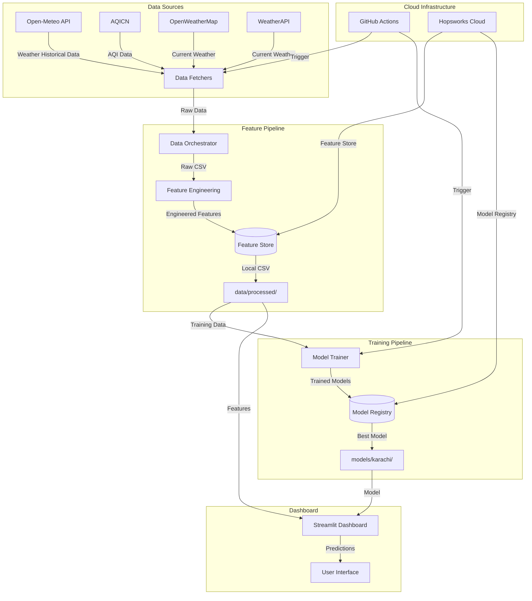

# Karachi AQI Prediction System

#Live streamlit app link is : https://pearlsaqi-szrcaeaofb5z6jdbktk9kg.streamlit.app/


A production-ready, serverless Air Quality Index (AQI) Prediction System for Karachi, Pakistan. This project implements an end-to-end machine learning pipeline with automated data collection, feature engineering, model training, and real-time predictions through an interactive web dashboard.

## 📋 Table of Contents

- [Project Overview](#-project-overview)
- [Architecture](#-architecture)
- [Features](#-features)
- [Quick Start](#-quick-start)
- [Setup Instructions](#-setup-instructions)
  - [Local Development](#local-development)
  - [Hopsworks Setup](#hopsworks-setup)
  - [Streamlit Community Cloud](#streamlit-community-cloud)
- [Pipeline Documentation](#-pipeline-documentation)
  - [Feature Pipeline](#feature-pipeline)
  - [Training Pipeline](#training-pipeline)
- [Dashboard Documentation](#-dashboard-documentation)
- [CI/CD Documentation](#-cicd-documentation)
  - [GitHub Actions Workflows](#github-actions-workflows)
  - [Testing](#testing)
- [API Reference](#-api-reference)
- [Model Performance](#-model-performance)
- [Karachi-Specific Features](#-karachi-specific-features)
- [AQI Categories](#-aqi-categories)
- [Contributing](#-contributing)
- [License](#-license)
- [Acknowledgments](#-acknowledgments)

---

## 🌟 Project Overview

This system predicts the Air Quality Index (AQI) in Karachi, Pakistan for the next 3 days using weather and pollutant data. It uses a **100% serverless stack** with Hopsworks Feature Store and Model Registry integration.

### Key Capabilities

| Capability | Description |
|------------|-------------|
| **Data Collection** | Fetches historical weather data from Open-Meteo (40+ years), current AQI from AQICN, OpenWeatherMap, WeatherAPI |
| **Feature Engineering** | 127+ engineered features including cyclical time encodings, rolling windows, lag features, weather interactions |
| **Model Training** | 11 ML models with automatic selection based on RMSE performance |
| **Real-time Dashboard** | Interactive Streamlit dashboard with live predictions, EDA, SHAP explainability, and alerts |
| **Automation** | Hourly feature updates, daily model retraining via GitHub Actions |
| **Deployment** | Ready for Streamlit Community Cloud deployment |

---

## 🏗️ Architecture

### System Architecture Diagram



### Data Flow

```
┌─────────────────┐     ┌─────────────────┐     ┌─────────────────┐
│  Data Sources  │────▶│ Feature Pipeline│────▶│  Hopsworks FS  │
│  (4 APIs)      │     │  (Hourly)       │     │  (Cloud)       │
└─────────────────┘     └─────────────────┘     └─────────────────┘
                                                        │
                                                        ▼
┌─────────────────┐     ┌─────────────────┐     ┌─────────────────┐
│  Streamlit     │◀────│  Model Registry │◀────│ Training Pipeline│
│  Dashboard     │     │  (Cloud)        │     │  (Daily)        │
└─────────────────┘     └─────────────────┘     └─────────────────┘
```

---

## 🚀 Features

### 1. Data Collection

| Source | Data Type | Update Frequency |
|--------|-----------|------------------|
| [Open-Meteo Archive API](https://open-meteo.com/en/docs) | Historical weather (40+ years) | On-demand backfill |
| [AQICN](https://aqicn.org/data-platform/token/) | Real-time AQI | Hourly |
| [OpenWeatherMap](https://openweathermap.org/api) | Current weather | Hourly |
| [WeatherAPI](https://www.weatherapi.com/) | Current weather | Hourly |

### 2. Feature Engineering

The system generates **127+ features** including:

- **Cyclical Time Encodings**: Sin/Cos transformations for hour, day of week, month, and day of year
- **Rolling Window Features**: 24-hour and 7-day rolling averages, min, max, std
- **Lag Features**: 1h, 2h, 3h, 6h, 12h, 24h, 48h, 72h, and 7-day lags
- **Weather Interactions**: Temperature-humidity, wind-pressure, visibility-humidity
- **Karachi-Specific Features**: Sea breeze effect, temperature inversion risk, pollution accumulation risk, seasonal indicators

### 3. Model Training

**11 ML Models** trained and evaluated:

| Rank | Model | RMSE | R² |
|------|-------|------|-----|
| 1 | Ridge Regression | 0.0144 | 0.9999 |
| 2 | Extra Trees | 0.0449 | 0.9997 |
| 3 | Gradient Boosting | 0.0522 | 0.9996 |
| 4 | Random Forest | 0.0598 | 0.9995 |
| 5 | XGBoost | 0.0654 | 0.9993 |
| 6 | LightGBM | 0.1234 | 0.9978 |
| 7 | Lasso | 0.0953 | 0.9987 |
| 8 | ElasticNet | 0.1542 | 0.9965 |
| 9 | AdaBoost | 0.9841 | 0.8592 |
| 10 | KNN | 2.3656 | 0.6872 |
| 11 | TensorFlow Neural Network | 16.01 | 0.1245 |

### 4. Web Dashboard

**4 Interactive Tabs:**

1. **Live Dashboard**: Real-time AQI gauges, trend charts, 3-day forecast
2. **EDA Tab**: Correlation heatmaps, pollutant distributions, temporal patterns
3. **Model X-Ray**: SHAP feature importance, model interpretation
4. **AQI Alerts**: Customizable alerts with notification history

### 5. Automation

- **GitHub Actions** workflows:
  - Feature pipeline: Runs hourly
  - Training pipeline: Runs daily
  - CI/CD: Runs on push/PR
- **Hopsworks Integration**: Feature Store and Model Registry

---

## ⚡ Quick Start

### Prerequisites

- Python 3.10+
- Git
- API Keys (see below)

### 5-Minute Setup

```bash
# 1. Clone the repository
git clone https://github.com/your-username/aqi_predictor.git
cd aqi_predictor

# 2. Create virtual environment
python -m venv venv
venv\Scripts\activate  # Windows
# source venv/bin/activate  # Linux/Mac

# 3. Install dependencies
pip install -r requirements.txt

# 4. Configure environment variables
copy .env.example .env

# 5. Run feature pipeline (first time - 2 years backfill)
python run_pipeline.py --mode features --feature-mode backfill --years 2

# 6. Train models
python run_pipeline.py --mode train

# 7. Start dashboard
streamlit run dashboard/app.py
```

---

## 📦 Setup Instructions

### Local Development

#### 1. Clone and Setup

```bash
# Clone repository
git clone https://github.com/your-username/aqi_predictor.git
cd aqi_predictor

# Create virtual environment
python -m venv venv

# Activate (Windows)
venv\Scripts\activate

# Activate (Linux/Mac)
source venv/bin/activate

# Install dependencies
pip install -r requirements.txt
```

#### 2. Environment Variables

Copy [``.env.example``](.env.example) to **`.env`** and configure:

```bash
# Copy the example file
copy .env.example .env  # Windows
# cp .env.example .env  # Linux/Mac
```

#### Environment Variables Reference

| Variable | Required | Description | How to Get |
|----------|----------|-------------|------------|
| `HOPSWORKS_API_KEY` | Yes* | Hopsworks Feature Store & Model Registry | [hopsworks.ai](https://app.hopsworks.ai/account) |
| `HOPSWORKS_PROJECT_NAME` | Yes* | Your Hopsworks project name | Created in Hopsworks |
| `AQICN_API_TOKEN` | Yes | AQICN API token for AQI data | [aqicn.org](https://aqicn.org/data-platform/token/) |
| `OPENWEATHERMAP_API_KEY` | No | OpenWeatherMap API key | [openweathermap.org](https://openweathermap.org/api) |
| `WEATHERAPI_KEY` | No | WeatherAPI key | [weatherapi.com](https://www.weatherapi.com/) |
| `HOPSWORKS_HOST` | No | Hopsworks host (default: c.app.hopsworks.ai) | - |
| `LOG_LEVEL` | No | Logging level (default: INFO) | - |

*Required only if using Hopsworks cloud features

#### 3. Directory Structure

```
aqi_predictor/
├── api/                          # API integration module
│   ├── fetchers/
│   │   ├── base.py              # Base fetcher class
│   │   └── providers.py          # Open-Meteo, AQICN, OpenWeatherMap, WeatherAPI
│   ├── schemas/
│   │   ├── data_models.py        # Pydantic data models
│   │   └── __init__.py           # Schema exports
│   └── orchestrator.py           # Data orchestration
├── config/
│   ├── settings.py               # Configuration with Karachi coordinates
│   └── __init__.py
├── dashboard/
│   └── app.py                   # Streamlit dashboard with 4 tabs
├── features/
│   ├── feature_engineering.py    # Feature generators
│   ├── main.py                  # Feature pipeline entry point
│   └── __init__.py
├── models/
│   ├── trainer.py                # ModelFactory with 11 models
│   ├── training_pipeline.py      # Training orchestration
│   ├── __init__.py
│   └── registry/
│       ├── hopsworks_registry.py  # Hopsworks Model Registry
│       ├── hopsworks_pipeline.py # Complete Hopsworks pipeline
│       └── __init__.py
├── scripts/
│   ├── upload_features_to_hopsworks.py
│   ├── download_features_from_hopsworks.py
│   ├── upload_model_to_hopsworks.py
│   └── test_connections.py
├── data/
│   ├── raw/                      # Raw data storage
│   └── processed/                # Engineered features
├── models/karachi/               # Trained models
├── .github/workflows/           # GitHub Actions
│   ├── feature-pipeline.yml     # Hourly feature pipeline
│   ├── training-pipeline.yml    # Daily training
│   └── tests.yml               # CI/CD tests
├── requirements.txt             # Dependencies
├── run_pipeline.py              # Main entry point
├── .env.example                # Environment template
└── README.md                   # This file
```

### Hopsworks Setup

[Hopsworks](https://www.hopsworks.ai/) provides the Feature Store and Model Registry for this system.

#### 1. Create Hopsworks Account

1. Go to [hopsworks.ai](https://www.hopsworks.ai/) and create a free account
2. Create a new project (e.g., `aqi_predictor`)
3. Generate an API key from Settings → API Keys

#### 2. Configure Hopsworks

Add to your `.env` file:

```env
HOPSWORKS_API_KEY=your_api_key_here
HOPSWORKS_PROJECT_NAME=your_project_name
HOPSWORKS_HOST=c.app.hopsworks.ai
```

#### 3. Test Connection

```bash
python scripts/test_hopsworks_connection.py
```

#### 4. Store to Hopsworks

```bash
# Run full pipeline with Hopsworks storage
python run_pipeline.py --mode full --hopsworks
```

### Streamlit Community Cloud Deployment

Deploy your dashboard to Streamlit Community Cloud for free public access.

#### Prerequisites

- GitHub repository with this project
- Trained model in `models/karachi/`
- Processed data in `data/processed/`

#### Deployment Steps

1. **Push to GitHub**

   ```bash
   git init
   git add .
   git commit -m "Initial commit"
   git branch -M main
   git remote add origin https://github.com/your-username/aqi_predictor.git
   git push -u origin main
   ```

2. **Add Secrets to GitHub**

   Go to your repository → Settings → Secrets and variables → Actions, add:

   | Secret | Value |
   |--------|-------|
   | `HOPSWORKS_API_KEY` | Your Hopsworks API key |
   | `HOPSWORKS_PROJECT_NAME` | Your project name |
   | `AQICN_API_TOKEN` | Your AQICN token |
   | `OPENWEATHERMAP_API_KEY` | Your OpenWeatherMap key |
   | `WEATHERAPI_KEY` | Your WeatherAPI key |

3. **Deploy to Streamlit Cloud**

   - Go to [share.streamlit.io](https://share.streamlit.io/)
   - Sign in with GitHub
   - Click "New app"
   - Select your repository
   - Set:
     - Main file path: `dashboard/app.py`
     - Python version: `3.10`
   - Click "Deploy"

4. **Configure Environment Variables in Streamlit**

   In your deployed app settings (Advanced → Secrets):

   ```toml
   [general]
   HOPSWORKS_API_KEY = "your_api_key"
   HOPSWORKS_PROJECT_NAME = "your_project"
   AQICN_API_TOKEN = "your_token"
   OPENWEATHERMAP_API_KEY = "your_key"
   WEATHERAPI_KEY = "your_key"
   ```

---

## 📊 Pipeline Documentation

### Feature Pipeline

The feature pipeline fetches data from multiple sources and creates engineered features.

#### Running the Feature Pipeline

```bash
# Backfill historical data (first time setup)
python run_pipeline.py --mode features --feature-mode backfill --years 2

# Incremental update (regular runs)
python run_pipeline.py --mode features --feature-mode incremental --hours 24
```

#### Feature Pipeline Options

| Option | Description | Default |
|--------|-------------|---------|
| `--mode` | Pipeline mode: `features`, `train`, `full` | `full` |
| `--feature-mode` | Feature mode: `backfill`, `incremental` | `backfill` |
| `--years` | Years of historical data for backfill | 2 |
| `--hours` | Hours for incremental update | 24 |
| `--hopsworks` | Store to Hopsworks Feature Store | False |

#### Feature Engineering Modules

| Module | Description |
|--------|-------------|
| [`features/feature_engineering.py`](features/feature_engineering.py) | Core feature generators |
| [`features/main.py`](features/main.py) | Pipeline orchestration |

#### Key Classes

```python
# Cyclical Time Encoding
features.feature_engineering.CyclicalTimeEncoder

# Rolling Window Features
features.feature_engineering.RollingFeatureGenerator

# Lag Features
features.feature_engineering.LagFeatureGenerator

# Karachi-Specific Features
features.feature_engineering.KarachiFeatureGenerator
```

### Training Pipeline

The training pipeline trains multiple ML models and selects the best one based on RMSE.

#### Running the Training Pipeline

```bash
# Train models only
python run_pipeline.py --mode train

# Run full pipeline (features + training)
python run_pipeline.py --mode full

# Full pipeline with Hopsworks storage
python run_pipeline.py --mode full --hopsworks
```

#### Training Pipeline Options

| Option | Description | Default |
|--------|-------------|---------|
| `--mode` | Pipeline mode: `features`, `train`, `full` | `full` |
| `--years` | Years of data to use | 2 |
| `--hopsworks` | Store model to Hopsworks | False |

#### Model Training Modules

| Module | Description |
|--------|-------------|
| [`models/trainer.py`](models/trainer.py) | ModelFactory with 11 ML models |
| [`models/training_pipeline.py`](models/training_pipeline.py) | Training orchestration |
| [`models/registry/hopsworks_pipeline.py`](models/registry/hopsworks_pipeline.py) | Hopsworks integration |

#### Key Classes

```python
# Model Factory - trains all 11 models
models.trainer.ModelFactory

# Training Pipeline
models.training_pipeline.TrainingPipeline

# Hopsworks Feature Store
models.registry.hopsworks_pipeline.HopsworksFeatureStore

# Hopsworks Model Registry
models.registry.hopsworks_pipeline.HopsworksModelRegistry
```

---

## 📈 Dashboard Documentation

The Streamlit dashboard provides real-time AQI monitoring and predictions.

### Starting the Dashboard

```bash
streamlit run dashboard/app.py
```

The dashboard will be available at `http://localhost:8501`

### Dashboard Tabs

#### 1. Live Dashboard Tab

- **Current AQI Gauge**: Real-time AQI with color-coded display
- **3-Day Forecast**: Predicted AQI for next 72 hours
- **Trend Charts**: Historical AQI trends with interactive Plotly charts
- **Weather Overlay**: Temperature, humidity, wind speed overlays

#### 2. EDA Tab (Exploratory Data Analysis)

- **Correlation Heatmap**: Feature correlations with AQI
- **Pollutant Distributions**: Histograms and box plots
- **Temporal Patterns**: Hourly, daily, monthly AQI patterns
- **Weather Relationships**: Scatter plots showing weather-AQI relationships

#### 3. Model X-Ray Tab (SHAP Analysis)

- **Feature Importance**: SHAP summary plots
- **Feature Effects**: SHAP dependence plots
- **Model Decision**: Decision plots showing prediction paths
- **Global Interpretations**: Global feature importance across all predictions

#### 4. AQI Alerts Tab

- **Custom Thresholds**: Configure alert levels
- **Alert History**: Recent alerts with timestamps
- **Health Recommendations**: AQI-based health guidance

### Dashboard Configuration

| Setting | Environment Variable | Default |
|---------|---------------------|---------|
| Dashboard Title | `DASHBOARD_TITLE` | "Karachi AQI Prediction System" |
| Dashboard Icon | `DASHBOARD_ICON` | "🌬️" |

---

## 🔄 CI/CD Documentation

### GitHub Actions Workflows

The project includes three GitHub Actions workflows:

#### 1. Feature Pipeline (`.github/workflows/feature-pipeline.yml`)

Runs hourly to fetch latest data and update features.

| Trigger | Schedule |
|---------|----------|
| Hourly | `0 * * * *` |
| Manual | Workflow dispatch |

**Steps:**
1. Checkout code
2. Set up Python 3.10
3. Install dependencies
4. Run feature pipeline (backfill or incremental)
5. Upload features to Hopsworks
6. Upload artifacts

#### 2. Training Pipeline (`.github/workflows/training-pipeline.yml`)

Runs daily to retrain models with new data.

| Trigger | Schedule |
|---------|----------|
| Daily | `0 0 * * *` |
| Manual | Workflow dispatch |

**Steps:**
1. Checkout code
2. Set up Python 3.10
3. Install dependencies
4. Fetch latest features from Hopsworks
5. Run training pipeline
6. Upload model artifacts
7. Register model to Hopsworks

#### 3. CI/CD Tests (`.github/workflows/tests.yml`)

Runs on every push and pull request.

| Trigger | Branches |
|---------|----------|
| Push | main, develop |
| Pull Request | main, develop |

**Steps:**
1. Checkout code
2. Set up Python 3.10
3. Install dependencies
4. Lint with flake8
5. Run tests with pytest
6. Generate coverage report

### Required GitHub Secrets

| Secret | Description |
|--------|-------------|
| `HOPSWORKS_API_KEY` | Hopsworks API key |
| `HOPSWORKS_PROJECT_NAME` | Hopsworks project name |
| `AQICN_API_TOKEN` | AQICN API token |
| `OPENWEATHERMAP_API_KEY` | OpenWeatherMap API key |
| `WEATHERAPI_KEY` | WeatherAPI key |

### Testing

#### Running Tests Locally

```bash
# Install test dependencies
pip install pytest pytest-cov

# Run all tests
pytest tests/ -v

# Run with coverage
pytest tests/ --cov=. --cov-report=html
```

#### Test Structure

```
tests/
├── test_features.py      # Feature engineering tests
├── test_models.py        # Model training tests
├── test_api.py           # API fetcher tests
└── test_dashboard.py    # Dashboard tests
```

---

## 📚 API Reference

### Configuration

#### [`config/settings.py`](config/settings.py)

Main configuration class for the application.

```python
from config.settings import settings

# Karachi location
settings.KARACHI_LAT  # 24.8607
settings.KARACHI_LON  # 67.0011

# API URLs
settings.OPEN_METEO_URL
settings.AQICN_API_URL

# Hopsworks settings
settings.HOPSWORKS_API_KEY
settings.HOPSWORKS_PROJECT_NAME
settings.FEATURE_GROUP_NAME

# Model settings
settings.TARGET_COLUMN  # "aqi"
settings.TEST_SIZE  # 0.2
settings.RANDOM_STATE  # 42

# Forecast settings
settings.FORECAST_HOURS  # 72 (3 days)
```

### Data Fetchers

#### [`api/fetchers/base.py`](api/fetchers/base.py)

Base class for all API fetchers.

```python
from api.fetchers.base import BaseFetcher

class WeatherFetcher(BaseFetcher):
    def fetch(self, **kwargs) -> pd.DataFrame:
        """Fetch weather data."""
        pass
```

#### [`api/fetchers/providers.py`](api/fetchers/providers.py)

Implemented data providers.

| Class | Data Source |
|-------|-------------|
| `OpenMeteoFetcher` | Historical weather data |
| `AQICNFetcher` | Real-time AQI data |
| `OpenWeatherMapFetcher` | Current weather |
| `WeatherAPIFetcher` | Current weather |

### Feature Engineering

#### [`features/feature_engineering.py`](features/feature_engineering.py)

Core feature engineering classes.

| Class | Description |
|-------|-------------|
| `CyclicalTimeEncoder` | Sin/Cos encoding for time features |
| `RollingFeatureGenerator` | Rolling window statistics |
| `LagFeatureGenerator` | Time-based lag features |
| `KarachiFeatureGenerator` | Location-specific features |

```python
from features.feature_engineering import (
    CyclicalTimeEncoder,
    RollingFeatureGenerator,
    LagFeatureGenerator,
    KarachiFeatureGenerator
)

# Example usage
encoder = CyclicalTimeEncoder()
df = encoder.fit_transform(df)

roller = RollingFeatureGenerator(windows=[24, 168])
df = roller.fit_transform(df)
```

### Model Training

#### [`models/trainer.py`](models/trainer.py)

Model factory and training.

```python
from models.trainer import ModelFactory

factory = ModelFactory()
models, results = factory.train(df)

# Access results
best_model = results['best_model']
best_rmse = results['best_rmse']
```

### Hopsworks Integration

#### [`models/registry/hopsworks_pipeline.py`](models/registry/hopsworks_pipeline.py)

Hopsworks Feature Store and Model Registry integration.

```python
from models.registry.hopsworks_pipeline import (
    HopsworksFeatureStore,
    HopsworksModelRegistry
)

# Feature Store
fs = HopsworksFeatureStore()
fs.connect()
fs.create_feature_group(df, version=1)
fs.disconnect()

# Model Registry
mr = HopsworksModelRegistry()
mr.connect()
mr.register_model(model_path, model_name="karachi_aqi_predictor")
mr.disconnect()
```

---

## 📉 Model Performance

### Training Results

All models are evaluated using:
- **RMSE** (Root Mean Square Error)
- **MAE** (Mean Absolute Error)
- **R²** (Coefficient of Determination)

Results are stored in `models/karachi/training_results.json`.

### Best Model Selection

The system automatically selects the best model based on RMSE:

```python
# Example: Check best model
import json
with open('models/karachi/training_results.json') as f:
    results = json.load(f)
    print(f"Best Model: {results['best_model']}")
    print(f"Best RMSE: {results['best_rmse']}")
```

---

## 🌍 Karachi-Specific Features

The system includes several Karachi-specific features:

### 1. Sea Breeze Effect

Wind from the Arabian Sea (West direction) affects air quality.

```python
# Features generated
sea_breeze_west  # West wind component
sea_breeze_strength  # Magnitude of sea breeze
```

### 2. Temperature In nights with high pressure and low clouds trapversion Risk

Winter pollutants.

```python
# Features generated
temp_inversion_risk  # Risk score (0-1)
inversion_conditions  # Boolean indicator
```

### 3. Pollution Accumulation Risk

Low wind, high pressure, and no precipitation lead to pollution buildup.

```python
# Features generated
pollution_accumulation_risk  # Risk score (0-1)
stagnation_index  # Atmospheric stability
```

### 4. Seasonal Indicators

- **Monsoon**: June-September
- **Winter**: December-February
- **Summer**: May-July

```python
# Features generated
is_monsoon  # Boolean
is_winter  # Boolean
is_summer  # Boolean
season  # Categorical (0-3)
```

---

## 🎨 AQI Categories

| AQI Range | Category | Color | Health Implications |
|-----------|----------|-------|---------------------|
| 0-50 | Good | 🟢 Green | Air quality is satisfactory |
| 51-100 | Moderate | 🟡 Yellow | Acceptable for most |
| 101-150 | Unhealthy for Sensitive | 🟠 Orange | Sensitive groups may experience effects |
| 151-200 | Unhealthy | 🔴 Red | Everyone may experience effects |
| 201-300 | Very Unhealthy | 🟣 Purple | Health alert - serious effects |
| 301-500 | Hazardous | 🟤 Maroon | Emergency conditions |

---

## 🤝 Contributing

1. Fork the repository
2. Create a feature branch (`git checkout -b feature/amazing-feature`)
3. Make your changes
4. Run tests (`pytest tests/`)
5. Commit your changes (`git commit -m 'Add amazing feature'`)
6. Push to the branch (`git push origin feature/amazing-feature`)
7. Open a Pull Request

---

## 📄 License

MIT License - see [`LICENSE`](LICENSE) for details.

---

## 🙏 Acknowledgments

- [Open-Meteo](https://open-meteo.com/) for free weather data
- [AQICN](https://aqicn.org/) for AQI data
- [Hopsworks](https://www.hopsworks.ai/) for Feature Store and Model Registry
- [Streamlit](https://streamlit.io/) for the web dashboard
- [Scikit-learn](https://scikit-learn.org/) for machine learning tools

---

## 📊 Data Summary

| Metric | Value |
|--------|-------|
| **Location** | Karachi, Pakistan (24.8607° N, 67.0011° E) |
| **Training Data** | 18,120 records (Feb 2024 - Feb 2026) |
| **Features** | 127 columns |
| **Target** | AQI (Air Quality Index) |
| **Best Model** | Ridge Regression (RMSE=0.0144, R²=0.9999) |
| **Forecast Horizon** | 72 hours (3 days) |

---

*Built with ❤️ for Karachi's air quality awareness*
